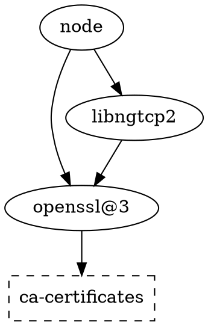
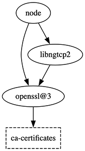

# brew.py

A lightweight replacement for Homebrew

see [usage](#usage) below.

[](doc/usage.mp4)


## Install

Copy `brew.py` to anywhere, where it can be found by your shell.
Or add a new path to your `$PATH`.

In your shell config (e.g., `.zprofile` or `.bash_profile`) add

```sh
# needed to run
export BREW_PY_CELLAR=$HOME/any/path/you/like
# optional, make binary available in shell
export PATH=$PATH:$BREW_PY_CELLAR/bin
```


Some packages use hard-coded path prefixes (e.g. Python).
For these, you need to create a symlink:

```sh
sudo ln -s $BREW_PY_CELLAR /opt/homebrew
```


And for auto-completion (zsh) add this to your `.zshrc` (before `compinit`):

```sh
# brew.py zsh auto-complete
fpath=($BREW_PY_CELLAR/share/zsh/site-functions $fpath)
# if not defined already:
autoload -Uz compinit && compinit
```


## Config

There are a few configuration options to modify brew.py behavior.
For default values and configuration options, see [config.ini](config.ini).


## FAQ

### Why this project?

Well, I hate dependencies.
For years, I have been avoiding Homebrew because of the large codebase and because Homebrew installs a lot of stuff in a lot of different places.
And I did not want to audit every single installation.

Most of the time, I just need a single binary and thus fallback to downloading that binary manually.
That's how this script started – as a way to download a single binary.
And then it escalated quickly.
Now I am trying to copy some of the functionality of brew itself and the, once simple script, is growing into a full-fledged Homebrew-alternative suite.

I don't know if anybody can make use of this, but here you go.


### What is the scope?

I don't know yet.
Maybe I will add more features, or copy more of the original brew CLI.
But most importantly, this script should be simple and dependency free.

brew.py focuses on:
- downloading pre-built binaries (bottles) from Brew.sh or GitHub registry
- re-link dynamic libraries (.dylib) to use relative paths
- provide a structure for other brew packages to link to shared libs

What brew.py does **NOT** do:
- build from source code
- search or browse packages (use Brew.sh for that)
- install from formula (only homebrew-core)
- cask management


## Usage

```
usage: brew.py [-h] [-v] [-q] [--version] command ...

A lightweight replacement for Homebrew

positional arguments:
  command
    info                List versions, dependencies, platforms, etc.
    home (homepage)     Open a project's homepage in a browser.
    fetch (download, bottle)
                        Download bottle (binary tar) for package.
    list (ls)           List installed packages.
    outdated (old)      Show packages with an updated version available.
    upgrade (update, up)
                        Upgrade outdated packages. Will delete old versions,
                        unless package is pinned. Pinned packages are skipped
                        by default but can be upgraded if provided
    deps                Show dependencies for package.
    uses                Show dependents of package (reverse dependencies).
    leaves              List installed packages that are not dependencies of
                        another package.
    missing             Check the given packages for missing dependencies. If
                        no packages are provided, check all kegs. Will exit
                        with a non-zero status if any are found to be missing.
    install (add)       Install package(s) with all dependencies.
    uninstall (remove, rm)
                        Remove / uninstall a package.
    link (ln)           Link a specific package version (activate).
    unlink              Remove symlinks for package to (temporarily) disable
                        it.
    switch              Change package version.
    toggle              Link/unlink all binaries of a single package. Can be
                        used to switch between versioned packages
                        (automatically disables other versions, e.g. node <=>
                        node@22).
    pin                 Prevent specified packages from being upgraded.
    unpin               Allow specified packages to be upgraded.
    cleanup (clean)     Remove old versions of installed packages. If
                        arguments are specified, only do this for the given
                        packages. Removes all downloads older than 21 days
                        (see config.ini).
    export              Take binary and all referenced libs to another folder
                        (relink all dylib)

optional arguments:
  -h, --help            show this help message and exit
  -v, --verbose         increase verbosity
  -q, --quiet           reduce verbosity (-q up to -qqq)
  --version             show program's version number and exit
```


#### Show dependencies

output of `brew.py deps node --tree`

```
node
├─╴brotli
├─╴c-ares
├─╴icu4c@77
├─╴libnghttp2
├─╴libnghttp3
├─╴libuv
├─╴simdjson
├─╴libngtcp2
│  └─╴openssl@3
│     └─╴ca-certificates
├─╴openssl@3
│  └─╴ca-certificates
├─╴sqlite
│  └─╴readline
├─╴uvwasi
│  └─╴libuv
└─╴zstd
   ├─╴lz4
   └─╴xz
```


... or inverse dependencies `brew.py uses ca-certificates --tree`

```
ca-certificates
└─╴openssl@3
   ├─╴node
   └─╴libngtcp2
      └─╴node
```


optionally as dot graph `brew.py uses ca-certificates --dot`



